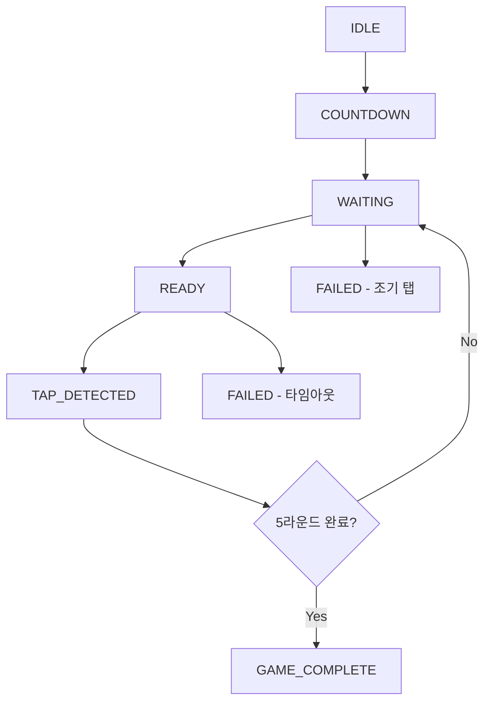
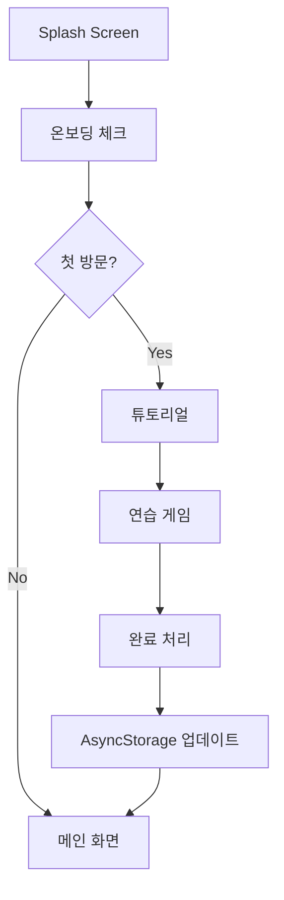
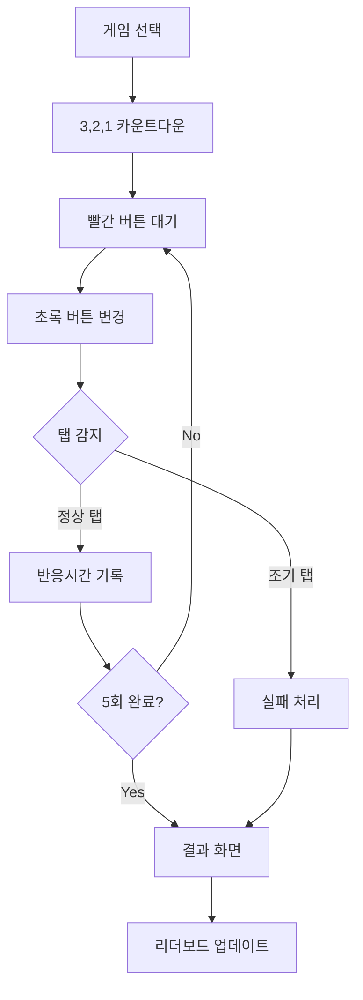
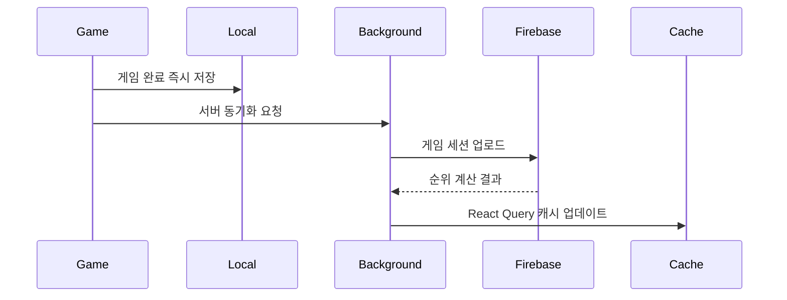

# 📱 순발력 측정 앱 기술 설계서

## 목차
- [기술 스택](#기술-스택)
- [프로젝트 구조](#프로젝트-구조)
- [데이터 저장 포맷](#데이터-저장-포맷)
- [게임 로직](#게임-로직)
- [주요 기능 플로우](#주요-기능-플로우)
- [성능 최적화](#성능-최적화)
- [보안 고려사항](#보안-고려사항)

---

## 🔧 기술 스택

### Frontend Framework
| 기술 | 버전 | 목적 |
|------|------|------|
| **React Native** | 0.72+ | Cross-platform 모바일 앱 개발 (iOS/Android 동시 지원) |
| **TypeScript** | ~5.8.3 | 타입 안정성 및 개발 생산성 향상 |
| **Expo** | ~53.0.20 | 개발 환경 및 네이티브 모듈 관리 |

### Navigation & Animation
| 기술 | 목적 |
|------|------|
| **React Navigation v6** | 화면 네비게이션 관리 |
| **React Native Reanimated v3** | 부드러운 애니메이션 구현 |
| **React Native Gesture Handler** | 정확한 터치 이벤트 처리 |

### State Management
| 기술 | 목적 |
|------|------|
| **Redux Toolkit + Redux Persist** | 전역 상태 관리 및 로컬 데이터 영속성 |
| **React Query (TanStack Query)** | 서버 상태 관리 및 캐싱 |

### Backend & Database
#### 🔥 Firebase (권장)
- **Firestore**: 리더보드 데이터 저장
- **Authentication**: 사용자 인증 (선택적)
- **Analytics**: 사용자 행동 분석

#### 🔄 Alternative: Supabase
- **PostgreSQL** 기반 실시간 데이터베이스

### Local Storage
| 기술 | 목적 |
|------|------|
| **AsyncStorage** | 로컬 게임 기록 저장, 온보딩 완료 여부 저장 |
| **MMKV** (선택적) | 더 빠른 로컬 스토리지 성능 |

### UI/UX Libraries
| 기술 | 목적 |
|------|------|
| **React Native Paper** 또는 **NativeBase** | UI 컴포넌트 라이브러리 |
| **Lottie React Native** | 온보딩 애니메이션 |
| **React Native SVG** | 커스텀 그래픽 요소 |

---


## 🏗️ 프로젝트 구조

```
src/
├── 📁 components/           # 재사용 가능한 UI 컴포넌트
│   ├── 📁 common/
│   │   ├── Button.tsx       # 공통 버튼 컴포넌트
│   │   ├── Card.tsx         # 카드 레이아웃 컴포넌트
│   │   └── Modal.tsx        # 모달 컴포넌트
│   ├── 📁 game/
│   │   ├── TapButton.tsx    # 게임용 탭 버튼
│   │   ├── CountdownTimer.tsx # 카운트다운 타이머
│   │   └── GameResult.tsx   # 게임 결과 표시
│   └── 📁 leaderboard/
│       ├── LeaderboardItem.tsx # 순위 아이템
│       └── RankDisplay.tsx  # 순위 표시 컴포넌트
│
├── 📁 screens/              # 화면 컴포넌트
│   ├── 📁 onboarding/
│   │   ├── SplashScreen.tsx      # 스플래시 화면
│   │   └── OnboardingScreen.tsx  # 온보딩 화면
│   ├── 📁 game/
│   │   ├── GameListScreen.tsx    # 게임 목록 화면
│   │   ├── TapTestScreen.tsx     # 탭 테스트 게임 화면
│   │   └── ResultScreen.tsx      # 결과 화면
│   └── 📁 leaderboard/
│       └── LeaderboardScreen.tsx # 리더보드 화면
│
├── 📁 navigation/           # 네비게이션 설정
│   ├── RootNavigator.tsx    # 루트 네비게이터
│   ├── GameNavigator.tsx    # 게임 네비게이터
│   └── types.ts             # 네비게이션 타입 정의
│
├── 📁 store/                # 전역 상태 관리
│   ├── index.ts             # 스토어 설정
│   ├── 📁 slices/
│   │   ├── gameSlice.ts     # 게임 상태 슬라이스
│   │   ├── userSlice.ts     # 사용자 상태 슬라이스
│   │   └── leaderboardSlice.ts # 리더보드 상태 슬라이스
│   └── persistConfig.ts     # 데이터 영속성 설정
│
├── 📁 services/             # 외부 서비스 연동
│   ├── 📁 api/
│   │   ├── firebaseService.ts   # Firebase 서비스
│   │   └── leaderboardApi.ts    # 리더보드 API
│   └── 📁 storage/
│       ├── localStorage.ts      # 로컬 스토리지 서비스
│       └── gameStorage.ts       # 게임 데이터 스토리지
│
├── 📁 hooks/                # 커스텀 훅
│   ├── useGameTimer.ts      # 게임 타이머 훅
│   ├── useLeaderboard.ts    # 리더보드 훅
│   └── useOnboarding.ts     # 온보딩 훅
│
├── 📁 utils/                # 유틸리티 함수
│   ├── gameLogic.ts         # 게임 로직 유틸
│   ├── statistics.ts        # 통계 계산 유틸
│   └── validators.ts        # 데이터 검증 유틸
│
├── 📁 types/                # TypeScript 타입 정의
│   ├── game.types.ts        # 게임 관련 타입
│   ├── user.types.ts        # 사용자 관련 타입
│   └── leaderboard.types.ts # 리더보드 관련 타입
│
└── 📁 constants/            # 상수 정의
    ├── game.constants.ts    # 게임 설정 상수
    └── theme.constants.ts   # 테마 및 스타일 상수
```

---
## 💾 데이터 저장 포맷

### 🗂️ Local Storage (AsyncStorage)

#### 사용자 프로필
```typescript
interface UserProfile {
  id: string;
  nickname?: string;
  createdAt: number;
  onboardingCompleted: boolean;
  preferences: {
    soundEnabled: boolean;
    vibrationEnabled: boolean;
  };
}
```

#### 게임 세션 기록
```typescript
interface GameSession {
  id: string;
  gameType: 'TAP_TEST' | 'OTHER_GAMES';
  userId: string;
  timestamp: number;
  attempts: ReactionAttempt[];
  statistics: GameStatistics;
  isCompleted: boolean;
  isFailed: boolean;
  failReason?: 'EARLY_TAP' | 'TIMEOUT';
}

interface ReactionAttempt {
  attemptNumber: number;
  reactionTime: number; // milliseconds
  isValid: boolean;
  timestamp: number;
}

interface GameStatistics {
  averageTime: number;
  bestTime: number;
  worstTime: number;
  totalAttempts: number;
  validAttempts: number;
}
```

### ☁️ Cloud Database (Firestore)

#### Collections Structure

##### `users/` 컬렉션
```typescript
{
  userId: string;
  nickname: string;
  totalGamesPlayed: number;
  bestReactionTime: number;
  averageReactionTime: number;
  createdAt: Timestamp;
  lastPlayedAt: Timestamp;
}
```

##### `leaderboard/` 컬렉션
```typescript
{
  id: string;
  userId: string;
  nickname: string;
  gameType: string;
  reactionTime: number; // Best reaction time
  averageTime: number;
  timestamp: Timestamp;
  deviceInfo: {
    platform: 'ios' | 'android';
    model: string;
  };
}
```

##### `game_sessions/` 컬렉션
```typescript
{
  sessionId: string;
  userId: string;
  gameType: string;
  startTime: Timestamp;
  endTime: Timestamp;
  attempts: Array<{
    attemptNumber: number;
    reactionTime: number;
    isValid: boolean;
  }>;
  statistics: {
    average: number;
    best: number;
    worst: number;
  };
  rank?: number; // 전체 순위
}
```

---
## 🎮 게임 로직

### 탭 테스트 게임 상태 관리
```typescript
enum GameState {
  IDLE = 'IDLE',
  COUNTDOWN = 'COUNTDOWN',
  WAITING = 'WAITING',
  READY = 'READY',
  TAP_DETECTED = 'TAP_DETECTED',
  ROUND_COMPLETE = 'ROUND_COMPLETE',
  GAME_COMPLETE = 'GAME_COMPLETE',
  FAILED = 'FAILED'
}

interface TapGameState {
  currentState: GameState;
  currentRound: number;
  totalRounds: number;
  waitStartTime?: number;
  readyStartTime?: number;
  results: number[];
  randomDelay: number; // 2-5초 랜덤 딜레이
}
```

### 게임 진행 흐름


---
## 🔄 주요 기능 플로우

### 📱 온보딩 플로우


1. **Splash Screen** → 앱 로고 표시 (2초)
2. **온보딩 체크** → AsyncStorage에서 완료 여부 확인
3. **튜토리얼** → 게임 방법 설명 (스와이프 가능)
4. **연습 게임** → 실제 게임 체험
5. **완료** → 메인 화면으로 이동

### 🎯 게임 플로우


1. **게임 선택** → 게임 리스트에서 선택
2. **준비** → 3, 2, 1 카운트다운
3. **대기** → 빨간 버튼 표시 (랜덤 2-5초)
4. **반응** → 초록 버튼 변경 시 탭
5. **기록** → 반응 시간 측정
6. **반복** → 5회 반복
7. **결과** → 통계 및 순위 표시

### 🏆 리더보드 업데이트


1. **로컬 저장** → 게임 완료 즉시
2. **서버 동기화** → 백그라운드에서 비동기 처리
3. **순위 계산** → 서버에서 실시간 계산
4. **캐시 업데이트** → React Query로 캐싱

---

## 📊 성능 최적화

### ⚡ 반응 시간 측정 정확도
| 최적화 기법 | 설명 |
|-------------|------|
| **Performance API** | 밀리초 단위 정확도로 타이밍 측정 |
| **RequestAnimationFrame** | UI 업데이트 최적화 |
| **Native Module** | 더 정확한 타이밍 (선택적) |

```typescript
// 고정밀 타이머 예시
const startTime = performance.now();
// 게임 로직 실행
const reactionTime = performance.now() - startTime;
```

### 🧠 메모리 관리
| 기법 | 적용 위치 | 효과 |
|------|-----------|------|
| **FlatList** | 리더보드 화면 | 대량 데이터 가상화 |
| **Image 캐싱** | 전체 앱 | 메모리 사용량 최적화 |
| **React.memo** | 컴포넌트 | 불필요한 리렌더링 방지 |
| **useMemo/useCallback** | 훅 | 연산 최적화 |

---

## 🔐 보안 고려사항

### 🛡️ 데이터 무결성
| 보안 계층 | 구현 방법 | 목적 |
|-----------|-----------|------|
| **클라이언트 검증** | 입력값 유효성 검사 | 기본적인 데이터 검증 |
| **서버 검증** | Firebase Functions | 최종 데이터 무결성 보장 |
| **Rate Limiting** | 요청 제한 | 비정상적인 기록 필터링 |
| **Device Fingerprinting** | 디바이스 식별 | 부정행위 탐지 및 방지 |

### 🔒 네트워크 보안 (선택적)
```typescript
// SSL Pinning 예시 (고급 보안)
const config = {
  certificatePinning: {
    hostname: 'your-api-domain.com',
    publicKeyHash: 'sha256/YOUR_PUBLIC_KEY_HASH'
  }
};
```

### 🚨 부정행위 방지 로직
```typescript
// 인간의 반응 시간 검증
const HUMAN_MIN_REACTION_TIME = 100; // 100ms
const HUMAN_MAX_REACTION_TIME = 2000; // 2초

function validateReactionTime(time: number): boolean {
  return time >= HUMAN_MIN_REACTION_TIME && time <= HUMAN_MAX_REACTION_TIME;
}
```

---

## 📝 개발 가이드라인

### 🎯 개발 우선순위
1. **Phase 1**: 기본 게임 기능 구현 (탭 테스트, 로컬 저장)
2. **Phase 2**: 온보딩 및 리더보드 추가
3. **Phase 3**: 성능 최적화 및 보안 강화
4. **Phase 4**: 추가 게임 모드 및 소셜 기능

### 🧪 테스트 전략
```typescript
// 단위 테스트 예시
describe('GameLogic', () => {
  it('should calculate correct reaction time', () => {
    const startTime = 1000;
    const endTime = 1250;
    expect(calculateReactionTime(startTime, endTime)).toBe(250);
  });
});
```

### 📱 플랫폼별 고려사항
| 플랫폼 | 특별 고려사항 |
|--------|---------------|
| **iOS** | - App Store 리뷰 가이드라인 준수<br>- 햅틱 피드백 최적화 |
| **Android** | - Material Design 가이드라인<br>- 다양한 화면 크기 대응 |

---

## 🚀 배포 및 운영

### 📦 빌드 설정
```json
{
  "expo": {
    "name": "QuickReflex",
    "version": "1.0.0",
    "platforms": ["ios", "android"],
    "updates": {
      "fallbackToCacheTimeout": 0
    }
  }
}
```

### 📈 모니터링
- **Firebase Analytics**: 사용자 행동 분석
- **Crashlytics**: 오류 추적 및 분석
- **Performance Monitoring**: 앱 성능 모니터링

---

*이 문서는 순발력 측정 앱의 기술적 구현을 위한 포괄적인 가이드입니다. 개발 과정에서 요구사항 변경에 따라 업데이트될 수 있습니다.*